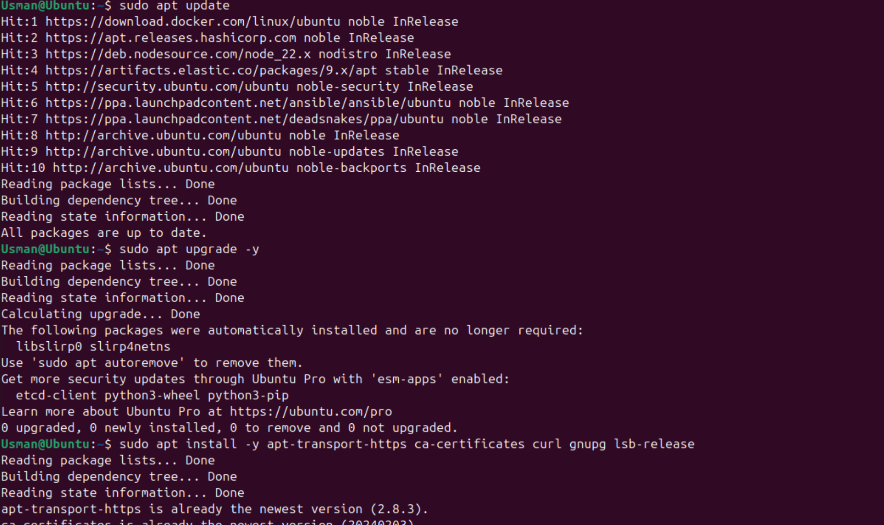
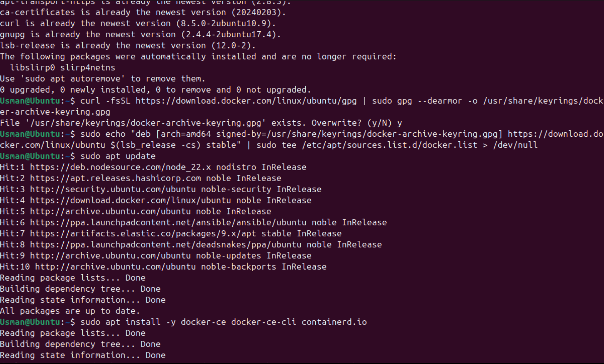
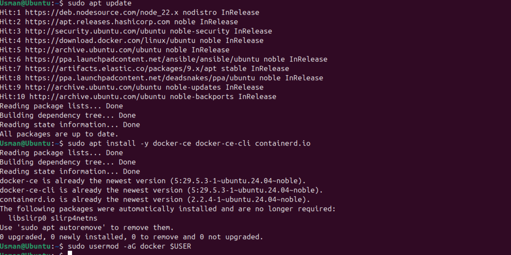
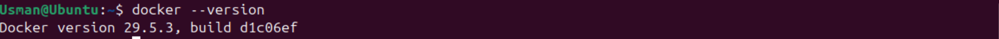
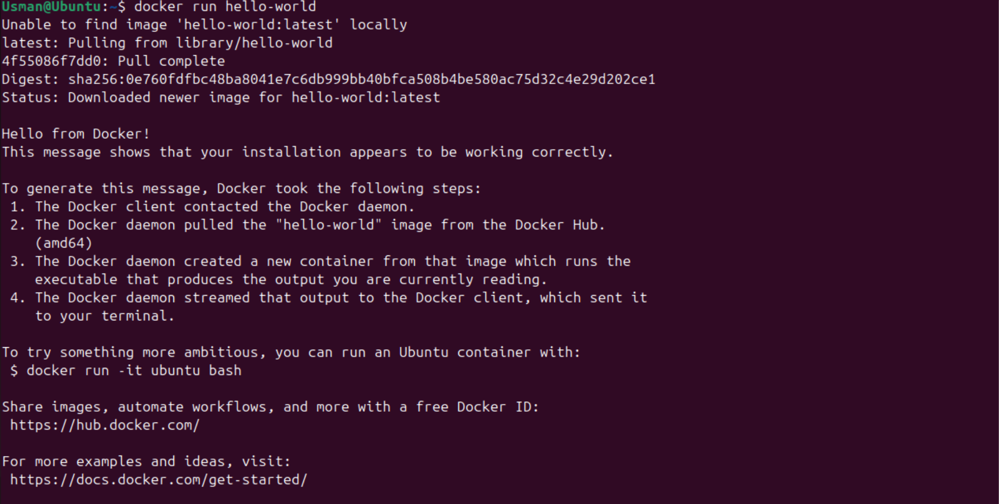
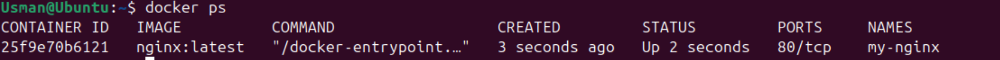
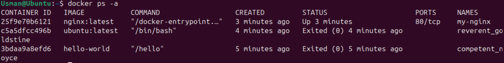
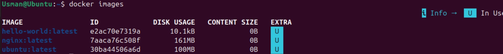
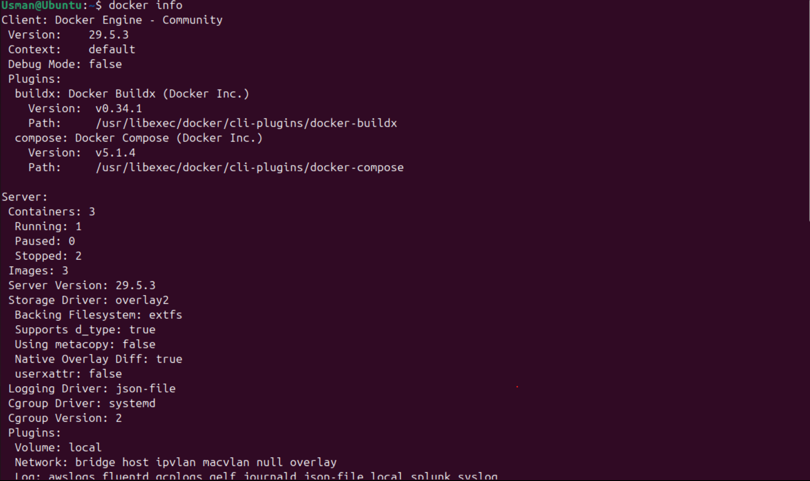

# Docker Lab-01-Introduction-to-Docker

## Overview

In this lab, I installed Docker Engine on Ubuntu Linux and explored fundamental Docker concepts, including images, containers, and container lifecycle management.

## Environment

- Operating System: Ubuntu Linux
- Docker Engine: Installed from the official Docker repository
- Lab Type: Hands-on Practical Exercise

## Objectives

- Install Docker Engine
- Verify Docker installation
- Understand Docker images and containers
- Run Docker containers
- Manage container lifecycle
- Explore Docker CLI commands

## Tasks Completed

### Docker Installation

Successfully installed Docker Engine using the official Docker repository.

### Verification

Verified Docker installation and service status.

### First Container

Executed the hello-world container to validate the Docker environment.

### Docker CLI Exploration

Worked with:

- docker ps
- docker ps -a
- docker images
- docker info

### Interactive Ubuntu Container

Started an Ubuntu container and explored the container environment.

### Nginx Container

Created, managed, stopped, and removed an Nginx container.

## Key Learnings

### Docker Image

A Docker image is a read-only template containing application code, runtime, libraries, and dependencies.

### Docker Container

A Docker container is a running instance of a Docker image.

### Containers vs Virtual Machines

Containers:
- Lightweight
- Faster startup
- Share the host kernel

Virtual Machines:
- Full operating system
- Higher resource consumption
- Stronger isolation

## Screenshots

### System Update

### Dependencies Installation

### Docker Installation

### Docker Version

### Hello World Container

### Running Container

### All Docker Containers

### Docker Images

### Docker Info

## Challenges Faced

- Understanding the difference between Docker images and containers
- Learning Docker's installation process on Ubuntu
- Managing container lifecycle commands

## Solutions

- Practiced using Docker CLI commands
- Explored container creation and removal workflows
- Compared containers with traditional virtual machines

## Conclusion

This lab provided practical experience with Docker installation, container management, and fundamental containerization concepts. These skills form the foundation for advanced Docker, Kubernetes, and DevOps workflows.
