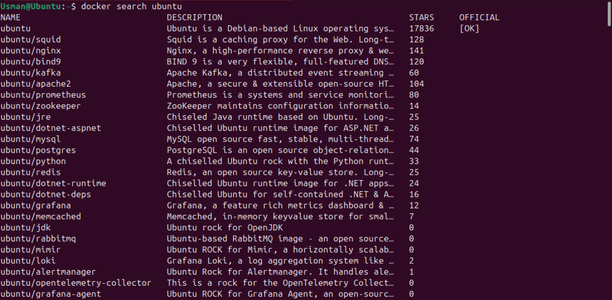
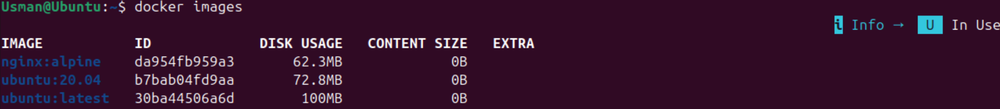
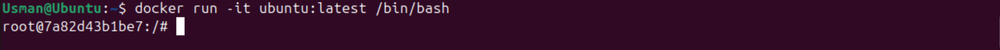
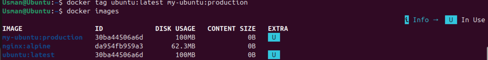
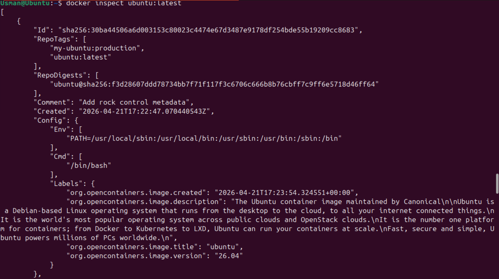
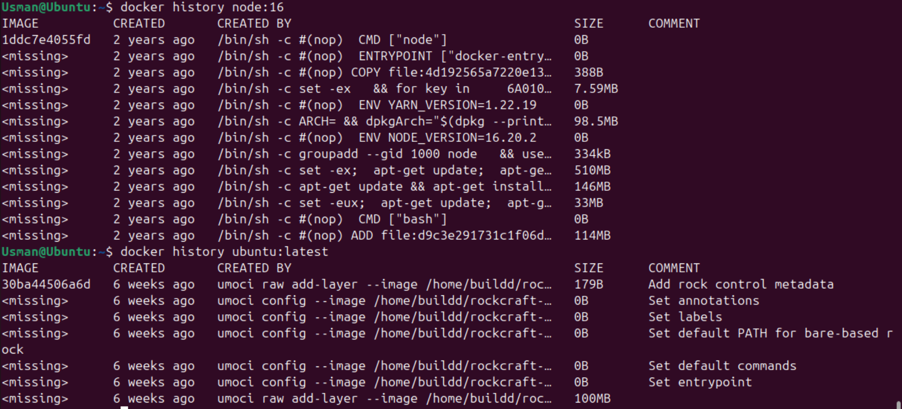

</> Markdown
# Docker Images Management and Layer Analysis

## Project Overview

This project demonstrates practical hands-on experience with Docker image management using Docker CLI. The lab focused on understanding Docker images, working with image tags, inspecting image metadata, analyzing image layers, and applying image management best practices.

The exercises were performed in a Linux environment using Docker Engine and included interaction with Docker Hub, image lifecycle management, and storage optimization techniques commonly used in modern DevOps environments.

---

## Objectives

* Search Docker images from Docker Hub
* Pull and manage Docker images locally
* Understand image tags and versioning
* Run containers using specific image versions
* Create custom image tags
* Inspect image metadata
* Analyze Docker image layers
* Perform image cleanup and storage optimization
* Apply Docker image management best practices

---

## Technologies Used

* Docker Engine
* Docker Hub
* Ubuntu Linux
* Nginx
* Python Runtime Images
* Docker CLI

---

## Lab Activities Performed

### Docker Hub Image Discovery

Docker Hub was explored using Docker CLI to identify official and community-maintained images. Ubuntu, Nginx, and Python repositories were analyzed based on popularity, official status, and use-case suitability.

docker search ubuntu
docker search nginx
docker search --limit 5 python

Key observations:

* Official images are maintained by trusted vendors
* Docker Hub provides version tags, documentation, and usage statistics
* Image selection impacts security, size, and maintainability

### 2. Pulling Docker Images

Downloaded multiple image versions and variants:

docker pull ubuntu
docker pull ubuntu:20.04
docker pull ubuntu:22.04
docker pull nginx:alpine
docker pull python:3.9-slim

Learned concepts:

* Image layers
* Layer caching
* Version-specific image pulls
* Lightweight image variants

### 3. Image Management

Listed and filtered locally stored images:

docker images
docker images -a
docker images -q

Used formatting options to improve readability:

docker images --format "table {{.Repository}}\t{{.Tag}}\t{{.Size}}"

### 4. Image Removal Operations

Removed images using:

docker rmi ubuntu:20.04
docker rmi IMAGE_ID
docker image prune

Practical understanding gained:

* Removing unused images
* Reclaiming storage space
* Dangling image cleanup

### 5. Running Version-Specific Containers

Executed containers using specific Ubuntu versions:

docker run -it ubuntu:22.04 /bin/bash

Verified operating system details:

cat /etc/os-release

This demonstrated version consistency across environments.

### 6. Custom Image Tagging

Created a custom production tag:

docker tag ubuntu:22.04 my-ubuntu:production

Verified tag creation:

docker images | grep my-ubuntu

### 7. Image Inspection

Collected detailed image metadata:

docker inspect ubuntu:22.04

Retrieved specific attributes:

docker inspect --format='{{.Architecture}}' ubuntu:22.04
docker inspect --format='{{.Created}}' ubuntu:22.04
docker inspect --format='{{.Size}}' ubuntu:22.04

### 8. Docker Layer Analysis

Investigated image build history:

docker history ubuntu:22.04

Key findings:

* Images are built in layers
* Layers improve storage efficiency
* Shared layers reduce download time
* Layer caching accelerates deployments

## Screenshots

### Docker Image Search

### Listing Local Docker Images

### Running Ubuntu Container

### Custom Image Tagging

### Docker Image Inspection

### Docker Layer Analysis

## Evidence of Hands-On Work

All screenshots captured during lab execution are available in the `screenshots/` directory.

| File | Description |
|--------|------------|
| 01-docker-search-ubuntu.png | Searching Docker Hub for Ubuntu images |
| 02-docker-search-nginx.png | Searching Docker Hub for Nginx images |
| 03-docker-pull-ubuntu.png | Pulling Ubuntu image |
| 04-docker-images-list.png | Listing local Docker images |
| 05-image-format-output.png | Formatted image output |
| 06-running-ubuntu-container.png | Running Ubuntu container |
| 07-os-release-inside-container.png | Verifying Ubuntu version |
| 08-custom-image-tag.png | Creating custom image tag |
| 09-docker-inspect-output.png | Inspecting image metadata |
| 10-docker-history-output.png | Viewing image history |
| 11-image-layer-analysis.png | Docker layer analysis |
| 12-docker-cleanup.png | Docker cleanup operations |

## Key Concepts Learned

* Docker Images
* Docker Hub
* Image Tags
* Official Images
* Image Layers
* Layer Caching
* Image Inspection
* Image History
* Storage Optimization
* Container Versioning
* Docker Cleanup
* Image Lifecycle Management

## Best Practices Applied

* Used explicit image tags instead of the latest
* Preferred lightweight image variants where applicable
* Inspected image metadata before usage
* Analyzed image layers for optimization awareness
* Regularly removed unused images
* Practiced image version consistency

## Outcome

Successfully demonstrated practical Docker image management skills, including image discovery, downloading, inspection, tagging, cleanup, and layer analysis. The lab strengthened foundational knowledge required for containerized application deployment, Docker administration, and DevOps engineering workflows.
