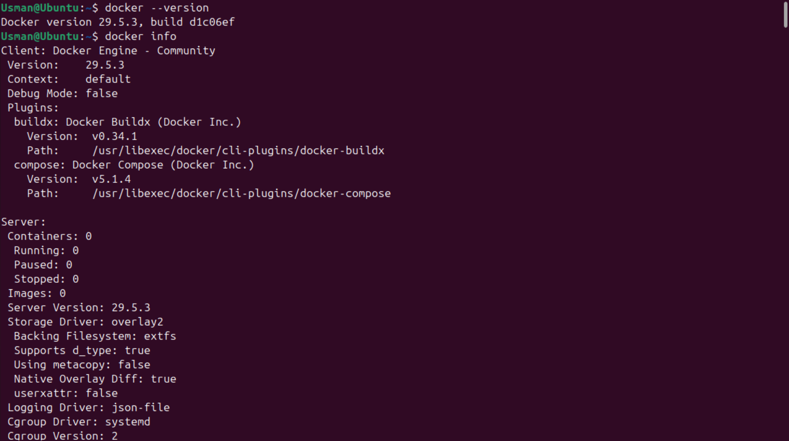
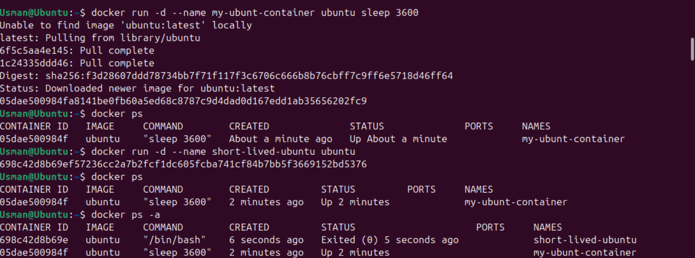
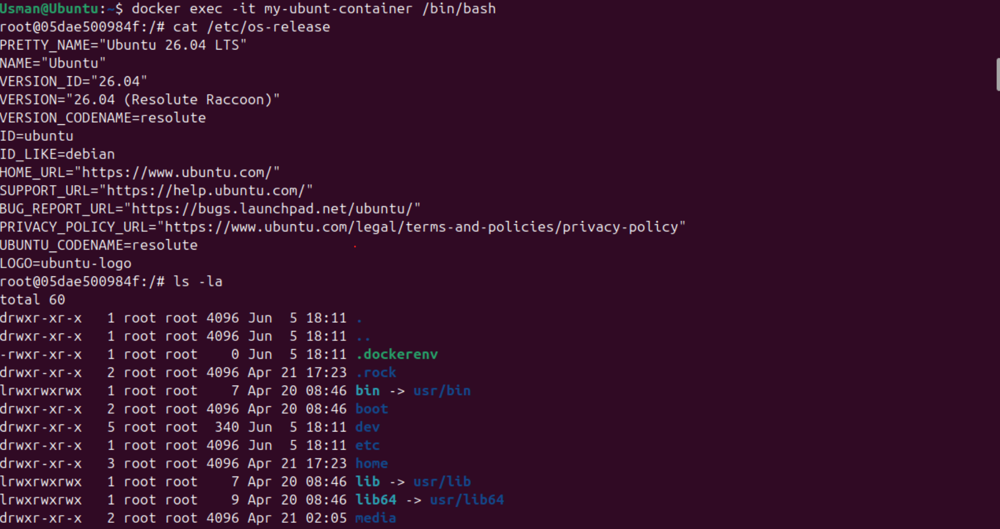
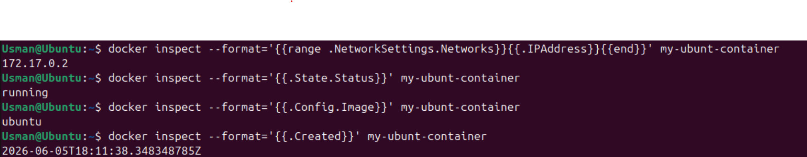
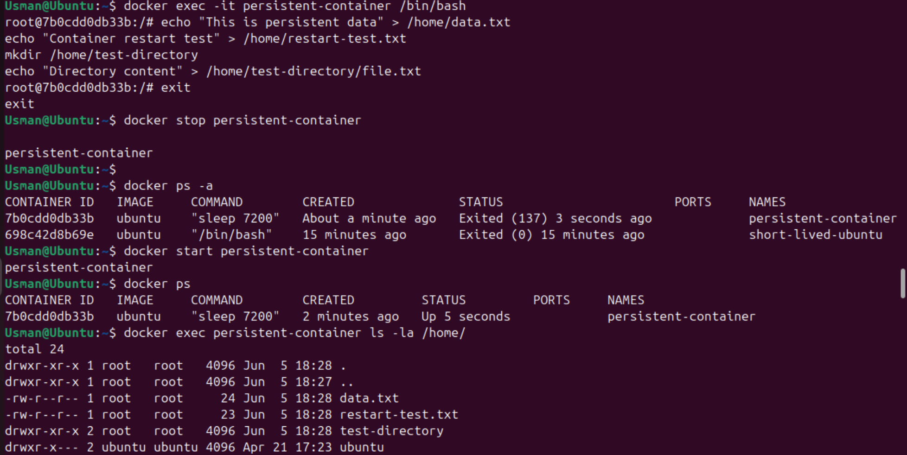
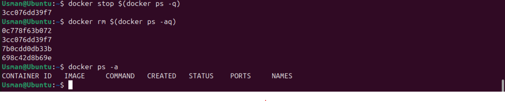

# Lab 03: Working with Containers and Lifecycle Management

[](https://www.docker.com/)
[](https://ubuntu.com/)
[](https://www.gnu.org/software/bash/)
[](https://alnafi.edu.pk/)

## 🎯 Lab Objectives

In this laboratory module, I focused on managing the full lifecycle of Docker containers on a pre-configured Ubuntu Linux host. Through hands-on practice, I developed skills mapped directly to the Docker Certified Associate (DCA) certification pathway, including:
* Creating and running Docker containers from images.
* Accessing running containers using interactive commands.
* Inspecting container details and configurations.
* Managing container lifecycle (start, stop, remove).
* Understanding container states and filesystem persistence.

---

## 💻 Commands Practiced

Below is the complete sequence of terminal commands executed during this lab session to manage runtime environments and analyze system states:

```bash
# --- Environment Setup Verification ---
# Check installed Docker Engine server and client version details
docker --version
# Display system-wide information including containers and storage drivers
docker info

# --- Task 1: Container Creation Workflows ---
# Create and start a container in detached mode with a long-running process
docker run -d --name my-ubuntu-container ubuntu sleep 3600
# List currently active running containers to verify configuration
docker ps
# Spin up an un-bound Ubuntu container to analyze immediate termination behavior
docker run -d --name short-lived-ubuntu ubuntu
# Review historical container states to see why the container stopped
docker ps -a

# --- Task 2: Interactive Operations (Docker Exec) ---
# Attach an interactive TTY Bash session to a live container environment
docker exec -it my-ubuntu-container /bin/bash
# (Commands executed inside the guest container space)
# cat /etc/os-release
# ls -la
# ps aux
# echo "Hello from inside the container" > /tmp/test.txt
# cat /tmp/test.txt
# exit

# Run target administrative inquiries directly from the host terminal
docker exec my-ubuntu-container hostname
docker exec my-ubuntu-container ls -la /tmp
docker exec my-ubuntu-container cat /tmp/test.txt

# --- Task 3: Metadata Manifest Inspection ---
# Inspect full structural properties configuration of a container asset
docker inspect my-ubuntu-container
# Extract isolated runtime network IP parameters using Go template syntax
docker inspect --format='{{range .NetworkSettings.Networks}}{{.IPAddress}}{{end}}' my-ubuntu-container
# Query current runtime operational state indicators
docker inspect --format='{{.State.Status}}' my-ubuntu-container
# Validate configuration tracking back to the source base image
docker inspect --format='{{.Config.Image}}' my-ubuntu-container
# Fetch explicit container engine initialization timestamps
docker inspect --format='{{.Created}}' my-ubuntu-container
# Inspect multi-container structural definitions concurrently
docker inspect my-ubuntu-container short-lived-ubuntu

# --- Task 4: Lifecycle Phase Management & Pruning ---
# Stop the active background process mapping gracefully
docker stop my-ubuntu-container
# Purge historical tracking filesystems for stopped containers
docker rm my-ubuntu-container
# Spin up a localized transient test workload container
docker run -d --name test-container ubuntu sleep 1800
# Force-remove a running container immediately via signal transmission
docker rm -f test-container
# Batch deploy multiple testing endpoints for mass cleanup trials
docker run -d --name container1 ubuntu sleep 300
docker run -d --name container2 ubuntu sleep 300
docker run -d --name container3 ubuntu sleep 300
# Execute bulk system resource clearing commands
docker rm -f container1 container2 container3

# --- Task 5: Filesystem Durability & Restart Profiles ---
# Instantiating persistent data laboratory check environment
docker run -d --name persistent-container ubuntu sleep 7200
# Populate the localized guest storage volume paths with testing text files
docker exec -it persistent-container /bin/bash -c 'echo "This is persistent data" > /home/data.txt && echo "Container restart test" > /home/restart-test.txt && mkdir /home/test-directory && echo "Directory content" > /home/test-directory/file.txt'
# Cycle down target workload and evaluate internal system records
docker stop persistent-container
docker start persistent-container
# Validate data survival following container state changes
docker exec persistent-container ls -la /home/
docker exec persistent-container cat /home/data.txt
# Query configuration fields to observe state changes across cycles
docker inspect --format='{{.State.Status}}' persistent-container
# Configure self-healing policy specifications for active engines
docker run -d --name auto-restart --restart=always ubuntu sleep 60
docker run -d --name restart-on-failure --restart=on-failure ubuntu sleep 60
# Verify that the self-healing policies are correctly set in the host configuration
docker inspect --format='{{.HostConfig.RestartPolicy.Name}}' auto-restart
docker inspect --format='{{.HostConfig.RestartPolicy.Name}}' restart-on-failure

# --- Final Lab Sandbox Environment Clean up ---
# Gracefully stop all active running container platforms on the host node
docker stop $(docker ps -q)
# Wipe away all container structural resources from the daemon tracking files
docker rm $(docker ps -aq)
```

---

## 📝 My Learning Notes

### Core Component Definitions
* **`docker run` vs `docker exec`:** `run` instantiates a brand new container from a static image file, spinning up an isolated namespace. `exec` injects a new process command into an *already existing, actively running* container for debugging or adjustments.
* **The detached flag (`-d`):** Forces the container process to decouple from the active terminal standard output stream, running silently as a background task.
* **The interactive flag combination (`-it`):** `-i` holds standard input (`stdin`) open for interaction, and `-t` allocates a pseudo-TTY terminal window mapping, simulating a real terminal access shell inside the environment.

### Key Lifecycle Observations & Mechanics
* **The PID 1 Requirement:** Base OS containers like `ubuntu` terminate instantly if no active execution payload is assigned. A container's runtime lifecycle is bound entirely to its primary worker application process (`PID 1`). Adding a trailing helper loop command like `sleep 3600` keeps the container active.
* **Workload File Durability Rule:** Data created within a container's filesystem remains intact during engine stop and start cycles. However, this storage space is ephemeral; once the parent container resource is deleted via `docker rm`, any untracked file data assets are lost forever.
* **Self-Healing Properties:** Setting policies like `--restart=always` tells the Docker engine to automatically bring a container back online if it crashes or if the daemon restarts, which is a vital concept for maintaining high availability in production environments.

---

## 📸 Step-by-Step Verification Screenshots

*I captured these visual status outputs while performing the lab configurations on the cloud host terminal:*

### Phase 1: Engine Diagnostics & Initial Deployments
*   
  *Inquiry tracking displaying active client and server connection details.*
*   
  *Validating background long-lived execution loops alongside the quick exit behavior of the un-bound container instance.*

### Phase 2: Interactivity Tests & Structural Manifest Inspections
*   
  *Verifying guest operating system configurations and writing mock tracking files inside temporary storage spaces.*
*   
  *Parsing structural values (IP configuration records, running state tags) from the core JSON metadata configuration blocks.*

### Phase 3: Runtime State Cycling & Sandbox Housekeeping
*   
  *Validating that the tracking text file remains readable inside the guest environment after a full container stop and restart sequence.*
*   
  *Wiping the node workspace clean using scripted expansion parameters before finalizing the laboratory run.*

---

## 🛠️ Troubleshooting & Engineering Insights

During my lab practice, I paid close attention to these four common error scenarios and learned how to resolve them using the terminal:

### 1. The Container Shuts Down Right After Startup
* **The Root Issue:** Running `docker run -d ubuntu` exits immediately because the base container finishes executing its default command and has no running background worker task to anchor `PID 1`.
* **My Fix:** Append an ongoing foreground execution instruction (such as `sleep 3600`) to force the runtime system to remain up and listening.

### 2. "Error: No such container" or "Container is not running" via Exec
* **The Root Issue:** Attempting to inject commands via `docker exec` into a container space that has crashed, closed, or moved into a stopped state.
* **My Fix:** Run `docker ps -a` to find the container's status, wake it back up using `docker start <container-name>`, and then execute the interactive shell command.

### 3. "Permission Denied" Output Errors Inside Guest Environments
* **The Root Issue:** Security profiles restrict default workspace users from running administrative updates or modifying protected core operating system configuration folders.
* **My Fix:** Override the default user context by appending the `--user root` parameter to the terminal statement: `docker exec -it --user root my-ubuntu-container /bin/bash`.

### 4. "Conflict: The container name already exists"
* **The Root Issue:** Trying to launch a new container with a specific `--name` tracking property when an older, stopped container instance is still occupying that namespace slot on the host.
* **My Fix:** Permanently drop the blocking structural records using `docker rm <container-name>` or choose a completely fresh identifier parameter.

---

## 🏁 Conclusion

This hands-on lab provided practical experience with container lifecycles, configuration parsing, and system state transitions under the Docker engine architecture. Mastering these foundational commands, automated self-healing restart loops, and troubleshooting steps directly prepares me for managing complex microservices, configuring cloud systems, and preparing for the Docker Certified Associate (DCA) certification exam.
