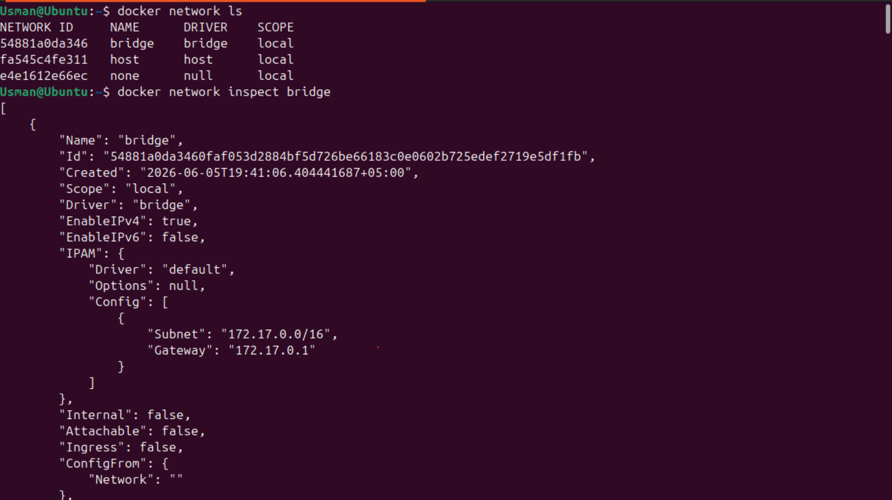
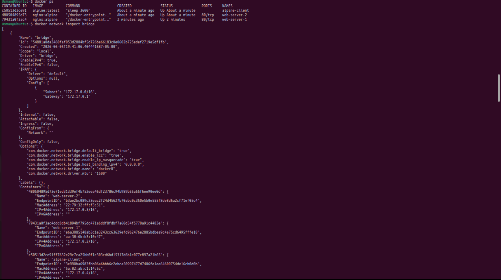
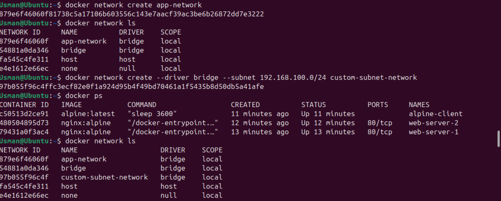
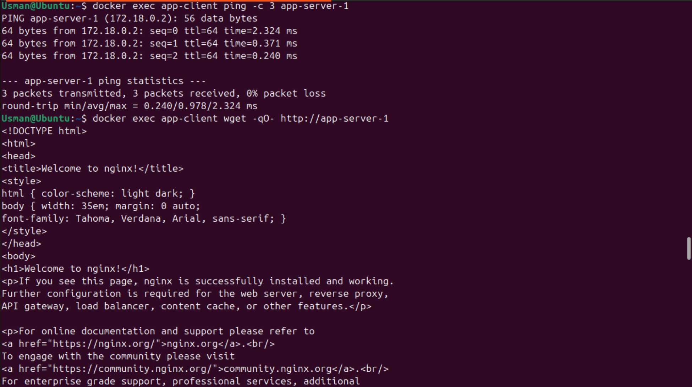
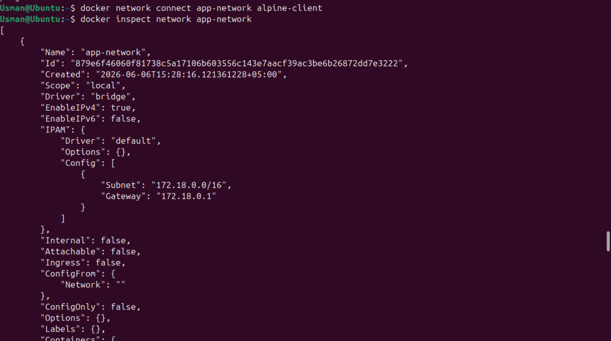
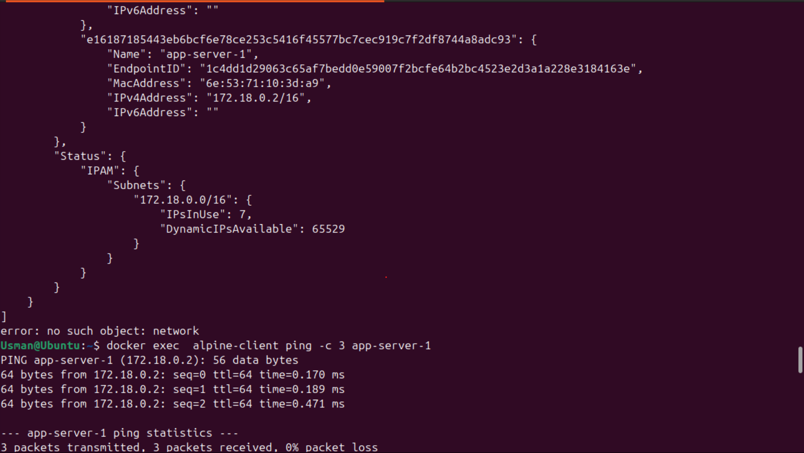
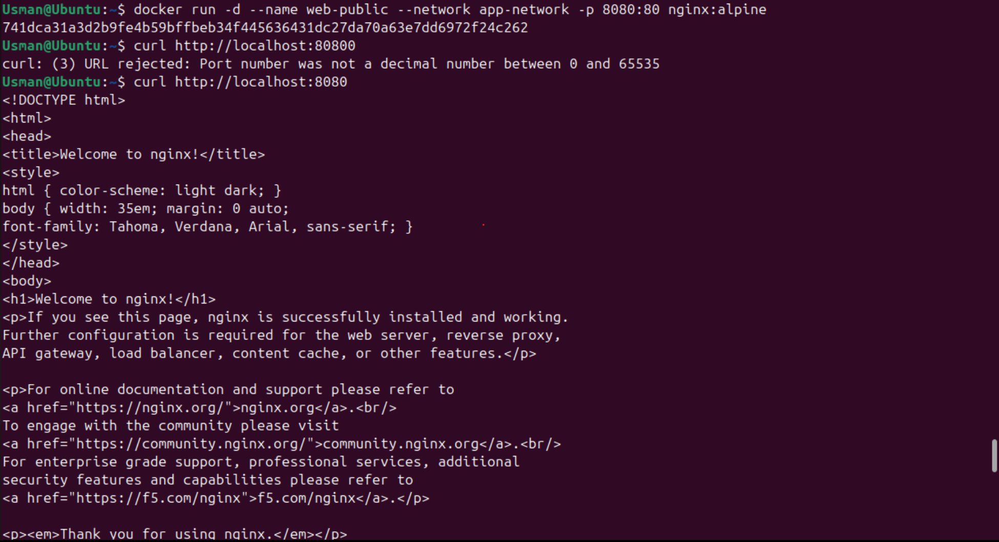
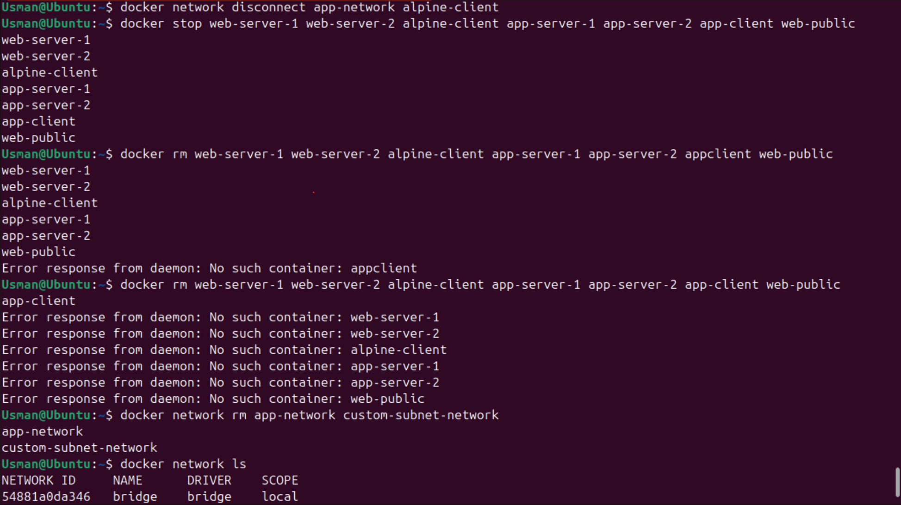

# Lab 04: Docker Networking Basics

[](https://www.docker.com/)
[](https://ubuntu.com/)
[](https://www.linux.org/)
[](https://www.gnu.org/software/bash/)
[](https://git-scm.com/)
[](https://alnafi.edu.pk/)

## 🎯 Lab Objectives

In this laboratory environment, I explored the fundamentals of Docker networking architectures, focusing on container isolation, automated service discovery, and custom topology management. Through hands-on exercises mapped to production requirements, I practiced:
* Interrogating Docker's default network drivers (bridge, host, and none).
* Creating custom user-defined bridge networks with isolated subnets.
* Evaluating network isolation parameters and cross-network communication blocks.
* Leveraging built-in Docker DNS service resolution using explicit container names.
* Exposing internal container application tiers via runtime port mapping.

---

## 💻 Commands Practiced

Below is the structured execution log containing all networking orchestration and diagnostic commands implemented during this lab session:

```bash
# ==========================================
# PHASE 1: DEFAULT BRIDGE ARCHITECTURE
# ==========================================

# List all available network namespaces on the local Docker daemon
docker network ls

# Inspect low-level JSON configuration metadata for the default bridge network
docker network inspect bridge

# Spin up an isolated background Nginx web application container on the default bridge
docker run -d --name web-server-1 nginx:alpine

# Verify the operational status and resource configuration of active workloads
docker ps

# Re-inspect the default bridge network to track assigned IP properties for web-server-1
docker network inspect bridge

# Deploy a secondary Nginx container onto the same default bridge infrastructure
docker run -d --name web-server-2 nginx:alpine

# Launch an interactive alpine test client and prevent early termination with a long sleep loop
docker run -d --name alpine-client alpine:latest sleep 3600

# Re-verify that all initial workloads are actively processing transactions
docker ps

# Query structural configuration to identify container endpoints connected to the bridge
docker network inspect bridge

# Extract the dynamically allocated IPv4 address of web-server-1 using Go formatting rules
docker inspect web-server-1 | grep IPAddress

# Test low-level ICMP echo response packet transmission from alpine-client using raw IP targets
# Note: Replace <IP_ADDRESS_OF_WEB_SERVER_1> with the actual parsed IP (e.g., 172.17.0.2)
docker exec alpine-client ping -c 3 <IP_ADDRESS_OF_WEB_SERVER_1>

# Test application-layer HTTP text stream handling by retrieving the Nginx landing page via IP address
docker exec alpine-client wget -qO- http://<IP_ADDRESS_OF_WEB_SERVER_1>


# ==========================================
# PHASE 2: CUSTOM TOPOLOGY & DNS MANAGEMENT
# ==========================================

# Provision a clean user-defined custom bridge network for logical application grouping
docker network create app-network

# Confirm the custom app-network driver namespace is actively tracking on the host
docker network ls

# Audit the structural details of the newly initialized app-network space
docker network inspect app-network

# Provision an advanced isolated bridge environment explicitly assigning a custom CIDR subnet block
docker network create --driver bridge --subnet=192.168.100.0/24 custom-subnet-network

# Validate that the custom IPAM block mapping is properly bound to the new engine driver
docker network inspect custom-subnet-network

# Bind and execute a new Nginx background workload targeting the user-defined app-network space
docker run -d --name app-server-1 --network app-network nginx:alpine

# Bind a duplicate server engine to the same custom application layer network
docker run -d --name app-server-2 --network app-network nginx:alpine

# Deploy a dedicated alpine verification client directly inside the app-network domain
docker run -d --name app-client --network app-network alpine:latest sleep 3600

# Validate automated Docker DNS service resolution by pinging a container name directly instead of an IP
docker exec app-client ping -c 3 app-server-1

# Validate application layer routing by processing automated HTTP requests using name hostnames
docker exec app-client wget -qO- http://app-server-1


# ==========================================
# PHASE 3: NETWORK ISOLATION & CLEANUP
# ==========================================

# Test cross-network infrastructure protection parameters (This operation must fail due to isolation boundaries)
docker exec app-client ping -c 3 web-server-1

# Dynamically link an existing, live container environment to an external secondary network segment
docker network connect app-network alpine-client

# Confirm that alpine-client is now safely tracking inside the app-network manifest
docker network inspect app-network

# Verify cross-network routing capability after explicitly establishing a multi-home link
docker exec alpine-client ping -c 3 app-server-1

# Expose an isolated backend container to external public queries using specific port mapping hooks
docker run -d --name web-public --network app-network -p 8080:80 nginx:alpine

# Perform a local host HTTP transaction routing to the container web application through port 8080
curl http://localhost:8080

# Verify internal communication remains functional on the user-defined backplane
docker exec app-client wget -qO- http://web-public

# Dynamically break an established running network binding connection
docker network disconnect app-network alpine-client

# Gracefully terminate all active processing worker containers on the host platform
docker stop web-server-1 web-server-2 alpine-client app-server-1 app-server-2 app-client web-public

# Permanently purge the historical tracking filesystems for all stopped workloads
docker rm web-server-1 web-server-2 alpine-client app-server-1 app-server-2 app-client web-public

# Wipe out custom-built bridge routing spaces to leave a clean production environment
docker network rm app-network custom-subnet-network

# Perform a final diagnostic check to ensure zero leaking network namespaces remain
docker network ls

# Confirm that the container monitoring list is completely clear of dormant tracking links
docker ps -a
```

---

## 📝 My Learning Notes

### Core Component Definitions
* **Default Bridge Network:** A standard virtual network adapter automatically created by the Docker engine daemon. Any container launched without an explicit target network defaults here, gaining access to an automatic `172.17.0.0/16` IP block.
* **User-Defined Custom Networks:** Manually provisioned routing environments that establish dedicated communication planes for application groupings. These custom bridges provide enhanced performance, strict network isolation, and dynamic DNS mapping.
* **Embedded Docker DNS Server:** An internal nameserver engine handled by the Docker daemon at `127.0.0.11`. It allows containers on **custom networks** to seamlessly locate and talk to each other using their literal container names instead of hardcoded, changing IP configurations.

### Key Lifecycle Observations & Mechanics
* **The Isolation Principle:** By default, containers resting on two separate bridge spaces cannot route data packets to one another, even if they are executing on the exact same hardware host. This boundary prevents unintended lateral data movement between different systems.
* **Multi-Homed Networking Capabilities:** A single, live container can be dynamically attached to multiple distinct network bridges concurrently using `docker network connect`. This structural design allows a single instance to act as a secure gateway router between independent system tiers.
* **External Port Binding Realities:** Containers are hidden from the outside world by default. To allow external traffic into a web app, the `-p host_port:container_port` option builds an explicit destination rule inside the host's iptables engine, mapping external traffic directly down into the container's private port.

---

## 📸 Step-by-Step Verification Screenshots

*I captured these visual status outputs while validating container routing states on the cloud host terminal:*

### Phase 1: Analyzing Default Networks & Initial Infrastructure
*   
  *Reviewing default driver spaces and tracking the structural properties block of the built-in bridge configuration.*
*   
  *Deploying initial web targets and client runtimes to observe IP mapping sequences.*

### Phase 2: Custom Bridge Subnets & Automated DNS Service Tests
*   
  *Initializing a custom application network plane along with explicit CIDR subnet allocations.*
*   
  *Validating automated DNS ping transactions and HTTP requests via literal container name mappings.*

### Phase 3: Traffic Control Boundaries & Multi-Homed Network Routing
*   
  *Validating total cross-network traffic blocking to ensure absolute data tier separation.*
* 
*    
  *Attaching active runtime systems to multiple segments simultaneously to unlock multi-point transport capability.*

### Phase 4: Public Ingress Rules & Sandbox Purging
*   
  *Validating host endpoint port-forwarding transactions via explicit curl operations.*
*   
  *Purging active and historical tracking containers and custom network resources to secure the workspace.*

---

## 🛠️ Troubleshooting & Engineering Insights

### 1. Host Name Lookups Fail Over Default Bridge Paths
* **The Root Issue:** Containers residing on the standard default `bridge` interface cannot resolve target host destinations using literal container name tags. The embedded DNS server disables name lookups on the default bridge to prevent name collisions across unrelated workloads.
* **My Fix:** Migrate workloads off the default bridge network and deploy them onto a user-defined custom network bridge using the `--network` configuration argument during initialization.

### 2. "Error: Network already exists" Diagnostic Blocks
* **The Root Issue:** Attempting to execute `docker network create` with a network tag name that is already registered inside the local storage metadata tracking database.
* **My Fix:** List running configurations via `docker network ls` to audit active namespaces, then use `docker network rm <network_name>` to drop the stale tracking records before redeploying.

### 3. "Error: Network has active endpoints" During Purge Operations
* **The Root Issue:** The engine rejects a network deletion request because one or more active or stopped container configurations are still bound to that network's interface.
* **My Fix:** Identify the bound containers using `docker network inspect <network_name>`, systematically remove the links via `docker network disconnect <network_name> <container_name>`, and then securely delete the network namespace.

---

## 🏁 Conclusion

This hands-on lab provided practical experience with Docker's core networking models, container isolation boundaries, and automated name resolution services. Mastering these fundamental commands, custom subnet allocations, and multi-network topologies prepares me to design secure, highly isolated network architectures for microservices in production enterprise environments.
