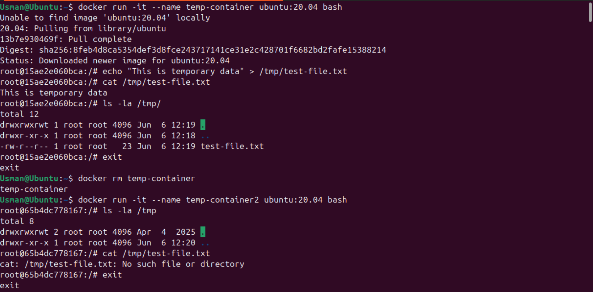
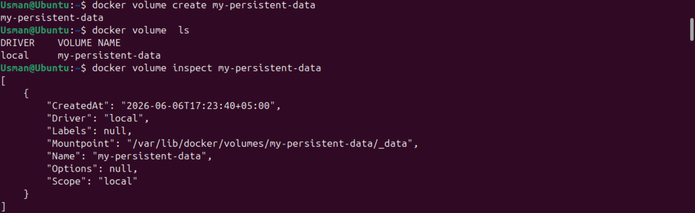
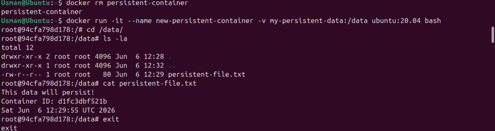
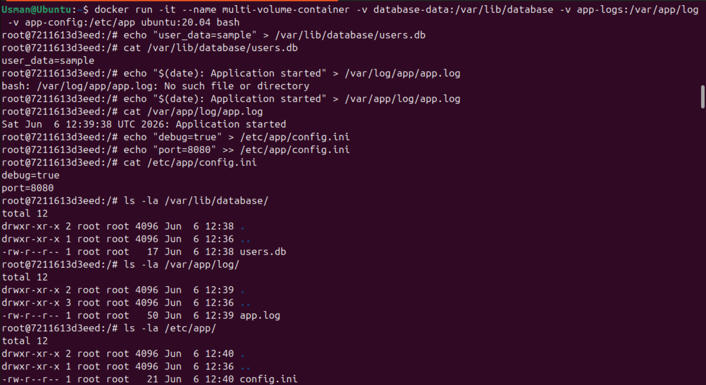
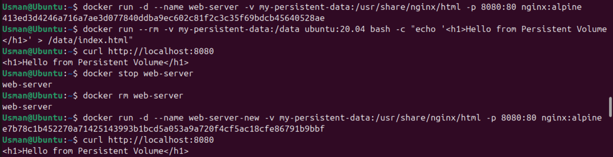
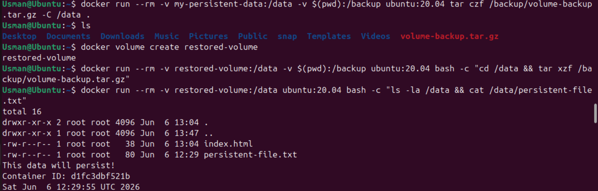
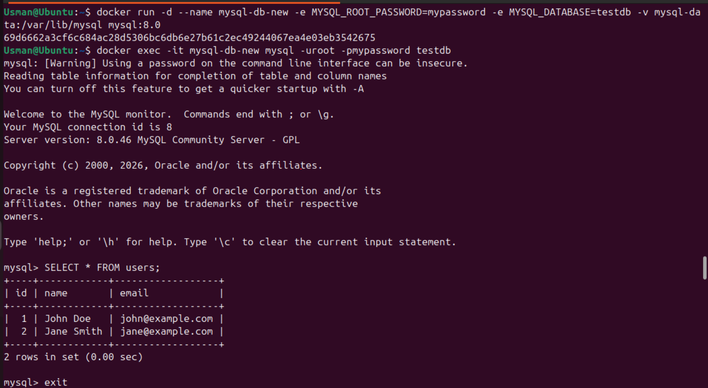
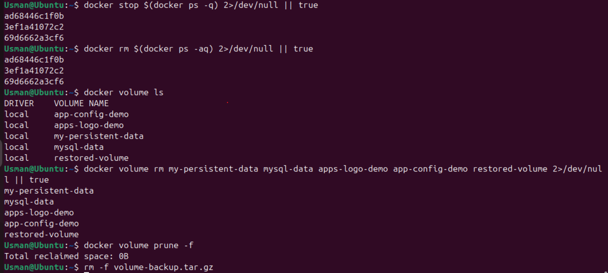

# Lab 05: Docker Volumes for Persistent Storage

[](https://www.docker.com/)
[](https://ubuntu.com/)
[](https://www.linux.org/)
[](https://www.gnu.org/software/bash/)
[](https://www.mysql.com/)
[](https://nginx.org/)

## 🎯 Lab Objectives

In this laboratory session, I explored the mechanics of container data persistence, moving away from stateless workloads to manage stateful architectures using Docker Volumes. Through hands-on validation tasks, I practiced:
* Analyzing the ephemeral nature of standard container copy-on-write filesystems.
* Creating, listing, inspecting, and pruning user-defined Docker storage volumes.
* Implementing isolation and shared state mechanics by mounting single and multiple volumes into active containers.
* Designing real-world stateful workloads using Nginx web servers and a MySQL relational database.
* Executing automated volume backup, archival, and point-in-time data restoration workflows.

---

## 💻 Commands Practiced

Below is the structured execution log containing all terminal commands, configuration overrides, and data archival procedures implemented during this session:

```bash
# ==========================================
# PHASE 1: EPHEMERAL STORAGE DIAGNOSTICS
# ==========================================

# Spin up an interactive Ubuntu container to test default file lifecycle behavior
docker run -it --name temp-container ubuntu:20.04 bash

# [INSIDE CONTAINER]: Generate a transient text string inside the /tmp partition
echo "This is temporary data" > /tmp/test-file.txt
cat /tmp/test-file.txt
ls -la /tmp/
exit

# Remove the container instance to simulate a standard teardown or crash event
docker rm temp-container

# Spin up a secondary container using the identical image blueprint to verify state retention
docker run -it --name temp-container2 ubuntu:20.04 bash

# [INSIDE CONTAINER]: Verify loss of unmapped data structures (this command returns an error)
ls -la /tmp/
cat /tmp/test-file.txt
exit

# Clean up the secondary validation container
docker rm temp-container2


# ==========================================
# PHASE 2: VOLUME LIFECYCLE MANAGEMENT
# ==========================================

# Audit existing storage volume mappings tracking on the host system
docker volume ls

# Provision a clean, named storage volume managed directly by the Docker daemon
docker volume create my-persistent-data

# Re-verify that the newly allocated volume exists within the engine's list
docker volume ls

# Inspect low-level JSON configuration and find the absolute host path (Mountpoint)
docker volume inspect my-persistent-data

# Provision multiple separate storage endpoints to simulate a tiered application structure
docker volume create database-data
docker volume create app-logs
docker volume create app-config

# Validate the batch storage volume setup on the host system
docker volume ls


# ==========================================
# PHASE 3: STATEFUL WORKLOADS & MOUNTING
# ==========================================

# Launch a new container while explicitly mounting the named volume to a internal target path
docker run -it --name persistent-container -v my-persistent-data:/data ubuntu:20.04 bash

# [INSIDE CONTAINER]: Populate the persistent directory with environmental tracking metrics
cd /data
echo "This data will persist!" > persistent-file.txt
echo "Container ID: $(hostname)" >> persistent-file.txt
date >> persistent-file.txt
ls -la
cat persistent-file.txt
exit

# Remove the container instance entirely to test storage layer decoupling
docker rm persistent-container

# Spin up a completely new container instance binding the identical persistent volume block
docker run -it --name new-persistent-container -v my-persistent-data:/data ubuntu:20.04 bash

# [INSIDE CONTAINER]: Verify that data successfully survived container destruction
cd /data
ls -la
cat persistent-file.txt
exit

# Attach multiple separate volumes into a single container to isolate different log/data streams
docker run -it --name multi-volume-container \
  -v database-data:/var/lib/database \
  -v app-logs:/var/log/app \
  -v app-config:/etc/app \
  ubuntu:20.04 bash

# [INSIDE CONTAINER]: Populate all decoupled storage spaces with realistic application state logs
mkdir -p /var/lib/database
echo "user_data=sample" > /var/lib/database/users.db
mkdir -p /var/log/app
echo "$(date): Application started" > /var/log/app/app.log
mkdir -p /etc/app
echo "debug=true" > /etc/app/config.ini
echo "port=8080" >> /etc/app/config.ini
ls -la /var/lib/database/ /var/log/app/ /etc/app/
exit

# Purge the multi-volume validation framework container
docker rm multi-volume-container


# ==========================================
# PHASE 4: APPLICATION PERSISTENCE & ARCHIVAL
# ==========================================

# Deploy a decoupled background Nginx web application with volume-backed HTML content storage
docker run -d --name web-server -v my-persistent-data:/usr/share/nginx/html -p 8080:80 nginx:alpine

# Use an ephemeral container to safely seed index data into the shared volume space
docker run --rm -v my-persistent-data:/data ubuntu:20.04 bash -c "echo '<h1>Hello from Persistent Volume!</h1>' > /data/index.html"

# Execute a local curl command against the mapped host port to verify web response delivery
curl http://localhost:8080

# Tear down the active Nginx application container completely
docker stop web-server
docker rm web-server

# Deploy a new web instance mounting the same target volume block to prove client data stability
docker run -d --name web-server-new -v my-persistent-data:/usr/share/nginx/html -p 8080:80 nginx:alpine

# Verify that the web page content remains accessible and unchanged
curl http://localhost:8080

# Stop the active validation web engine
docker stop web-server-new
docker rm web-server-new


# ==========================================
# PHASE 5: METADATA & DATA RETRIEVAL TRICKS
# ==========================================

# Isolate the precise absolute host storage path using text formatting filters
docker volume inspect my-persistent-data --format '{{.Mountpoint}}'
docker volume inspect my-persistent-data --format '{{.Driver}}'

# Dynamically extract and declare the mountpath variable on the host terminal shell
VOLUME_PATH=$(docker volume inspect my-persistent-data --format '{{.Mountpoint}}')
echo "Volume is mounted at: $VOLUME_PATH"

# Audit the root volume directory contents directly from the host terminal space
sudo ls -la $VOLUME_PATH
sudo cat $VOLUME_PATH/persistent-file.txt

# Prune unattached, dangling volume systems to reclaim storage blocks safely
docker volume prune

# Manually purge a single, specific decoupled storage layout
docker volume rm app-logs

# Clear any lingering storage bindings by checking active historical processes
docker ps -a
docker volume rm app-config
docker volume rm database-data


# ==========================================
# PHASE 6: BACKUP, RESTORE, & RECOVERY
# ==========================================

# Package and archive volume structures into a compressed tarball using a zero-footprint container
docker run --rm -v my-persistent-data:/data -v $(pwd):/backup ubuntu:20.04 tar czf /backup/volume-backup.tar.gz -C /data .

# Verify the compressed archive package file properties directly on the host system
ls -la volume-backup.tar.gz

# Initialize a clean target restoration volume blueprint inside the engine
docker volume create restored-volume

# Unpack and extract the compressed backup payload into the clean target destination space
docker run --rm -v restored-volume:/data -v $(pwd):/backup ubuntu:20.04 bash -c "cd /data && tar xzf /backup/volume-backup.tar.gz"

# Verify restoration precision by executing a single check command inside an ephemeral environment
docker run --rm -v restored-volume:/data ubuntu:20.04 bash -c "ls -la /data && cat /data/persistent-file.txt"


# ==========================================
# PHASE 7: ADVANCED STATEFUL DATABASE PIPELINES
# ==========================================

# Initialize a dedicated transactional storage container space for a relational engine
docker volume create mysql-data

# Spin up a background MySQL database container attached to the persistent volume mapping
docker run -d --name mysql-db -e MYSQL_ROOT_PASSWORD=mypassword -e MYSQL_DATABASE=testdb -v mysql-data:/var/lib/mysql mysql:8.0

# Pause execution briefly to let the internal database schema engines fully initialize
sleep 30

# Connect to the transactional client interface to execute data injection scripts
# Note: Type 'exit' to escape out of the MySQL shell once commands are completed
docker exec -it mysql-db mysql -uroot -pmypassword testdb

# [INSIDE MYSQL SHELL]:
# CREATE TABLE users (id INT AUTO_INCREMENT PRIMARY KEY, name VARCHAR(100), email VARCHAR(100));
# INSERT INTO users (name, email) VALUES ('John Doe', 'john@example.com'), ('Jane Smith', 'jane@example.com');
# SELECT * FROM users;

# Hard-kill and clear out the processing database container interface
docker stop mysql-db
docker rm mysql-db

# Launch a secondary database workload server linking to the exact same storage data directory
docker run -d --name mysql-db-new -e MYSQL_ROOT_PASSWORD=mypassword -e MYSQL_DATABASE=testdb -v mysql-data:/var/lib/mysql mysql:8.0

# Pause execution to let the engine thread attach safely to existing data files
sleep 30

# Re-interrogate the database tables to verify complete persistence of user records
docker exec -it mysql-db-new mysql -uroot -pmypassword testdb

# [INSIDE MYSQL SHELL]:
# SELECT * FROM users;


# ==========================================
# PHASE 8: APPLICATION CONFIGS & PIPELINE PURGING
# ==========================================

# Provision log demo infrastructure to handle automated text updates
docker volume create app-logs-demo
docker run -d --name log-generator -v app-logs-demo:/var/log/app ubuntu:20.04 bash -c "while true; do echo \$(date): Log entry >> /var/log/app/application.log; sleep 5; done"

# Monitor data processing streams in real time (Exit via Ctrl+C)
docker exec log-generator tail -f /var/log/app/application.log

# Stop and wipe the logging generator instance
docker stop log-generator
docker rm log-generator

# Verify file continuation by linking a secondary system to the log block
docker run -d --name log-generator-new -v app-logs-demo:/var/log/app ubuntu:20.04 bash -c "while true; do echo \$(date): New container log >> /var/log/app/application.log; sleep 5; done"
docker exec log-generator-new cat /var/log/app/application.log

# Build a dynamic configurations management tracking volume
docker volume create app-config-demo
docker run --rm -v app-config-demo:/config ubuntu:20.04 bash -c "echo 'server_port=8080' > /config/app.conf && echo 'debug_mode=true' >> /config/app.conf"

# Launch application loops to monitor the hot configuration values
docker run -d --name config-app -v app-config-demo:/etc/app ubuntu:20.04 bash -c "while true; do echo 'Reading config:'; cat /etc/app/app.conf; sleep 10; done"
docker logs config-app

# Dynamically alter configuration settings directly within the volume layout
docker run --rm -v app-config-demo:/config ubuntu:20.04 bash -c "echo 'server_port=9090' > /config/app.conf && echo 'debug_mode=false' >> /config/app.conf"

# Recycle the application environment to ensure configuration capture updates
docker stop config-app
docker rm config-app
docker run -d --name config-app-new -v app-config-demo:/etc/app ubuntu:20.04 bash -c "while true; do echo 'Reading config:'; cat /etc/app/app.conf; sleep 10; done"
docker logs config-app-new


# ==========================================
# PHASE 9: EMERGENCY DEEP CLEANUP ROUTINES
# ==========================================

# Forcibly terminate all running container workloads executing across the local system
docker stop $(docker ps -q) 2>/dev/null || true
docker rm $(docker ps -aq) 2>/dev/null || true

# Purge specific identified storage volume entities built throughout the lab execution
docker volume rm my-persistent-data mysql-data app-logs-demo app-config-demo restored-volume 2>/dev/null || true

# Execute a global system wipe on unattached storage links
docker volume prune -f

# Clean up local compressed archive files left over on the host
rm -f volume-backup.tar.gz
```

---

## 📝 My Learning Notes

### Core Component Definitions
* **Ephemeral Container Storage:** The scratch workspace built into standard running containers. It uses a temporary Copy-on-Write (CoW) system layer managed by drivers like overlay2. All mutations, file write changes, and log files generated inside this layout are permanently deleted when the container is stopped and removed.
* **Docker Volumes:** Highly managed storage directories provisioned outside the container lifecycle within isolated system host paths (`/var/lib/docker/volumes/`). They decouple data states from runtime components, protecting state entries from platform updates, teardowns, or sudden worker crashes.
* **Volume Mountpoint:** The absolute physical workspace path directly matching a Docker-managed storage volume on the underlying Linux host filesystem. This bridge layer enables standard operational processes to safely back up information assets.

### Key Lifecycle Observations & Mechanics
* **Storage Independence:** Docker volumes are independent storage assets. Removing an application container has zero effect on data stored inside an attached volume. This mechanism allows teams to upgrade software images while retaining state configurations.
* **Multi-Volume Injection Mapping:** Containers can cleanly ingest multiple named volumes into completely separate, independent inner target directory paths simultaneously. This allows architectures to separate slow database writes from high-velocity stream logging logs.
* **Archival and Restoration Portability:** Because volume architectures map to native Linux filesystems, small data-management utility containers can mount these folders to package directories into standardized, compressed tarballs for backup.

---

## 📸 Step-by-Step Verification Screenshots

*I captured these visual status outputs while validating volume decoupling states on the cloud host terminal:*

### Phase 1: Validating Ephemeral Erasures & Initializing Volumes
*   
  *Verifying data loss by observing file absence inside a secondary container after deleting an initial temporary workload.*
*   
  *Deploying named system volumes and evaluating core JSON config structures inside the metadata tracking logs.*

### Phase 2: Decoupled Volume Mounting & Multi-Volume Tiers
*   
  *Validating file persistence by verifying successful extraction of text entries across separate container instances.*
*   
  *Configuring tiered setups with separate database, configuration, and logging storage spaces.*

### Phase 3: Live Ingress Operations & Data Backup Tarballs
*   
  *Running an active Nginx web workload server and validating custom index page content retrieval via curl metrics.*
*   
  *Running zero-footprint data packaging operations to check tarball archive creation on the local host shell.*

### Phase 4: Stateful Databases & Global Workspace Purging
*   
  *Verifying relational database data persistence by extracting user table records across database server versions.*
*   
  *Cleaning up the local workspace by running volume pruning commands and dropping all remaining container components.*

---

## 🛠️ Troubleshooting & Engineering Insights

### 1. Volume Mount Permission Problems
* **The Root Issue:** Containers running with non-root system users encounter standard permission denied block errors when accessing data within newly mounted volume pathways. This happens because the host storage endpoint inherits default root ownership settings upon creation.
* **My Fix:** Run an ephemeral maintenance container task to adjust directory permissions using standard system commands:
  `docker run --rm -v my-persistent-data:/data ubuntu:20.04 chmod 755 /data`

### 2. Volume Target Failures and Empty Mappings
* **The Root Issue:** Attempting to build an engine configuration referencing a non-existent or mispelled volume key string causes Docker to automatically create an empty volume directory workspace rather than throwing a system error.
* **My Fix:** Always execute `docker volume create <volume_name>` explicitly before running your container to ensure the target layout matches your intended configurations.

### 3. "Volume is in use" Deletion Invalidation Errors
* **The Root Issue:** The engine daemon explicitly blocks execution of `docker volume rm` tasks if any container target—including fully stopped or dormant historical container tracks—maintains an active mount map link against that volume.
* **My Fix:** Isolate the active consumer containers using targeted filter arguments, terminate the running container blocks, clear out historical tracks, and complete the volume teardown:
```bash
  docker ps -a --filter volume=my-persistent-data
  docker rm <container_name>
  docker volume rm my-persistent-data
  ```

---

## 🏁 Conclusion

This hands-on lab demonstrated how to transition container infrastructures from stateless units into robust, stateful architectures using Docker Volumes. Mastering these filesystem mapping workflows, data archival strategies, and multi-volume strategies allows me to design high-availability database pipelines and secure logging models across enterprise cloud-native environments.
