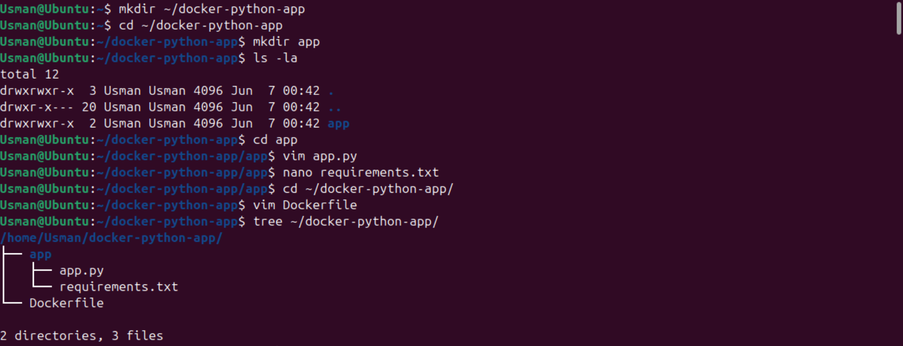
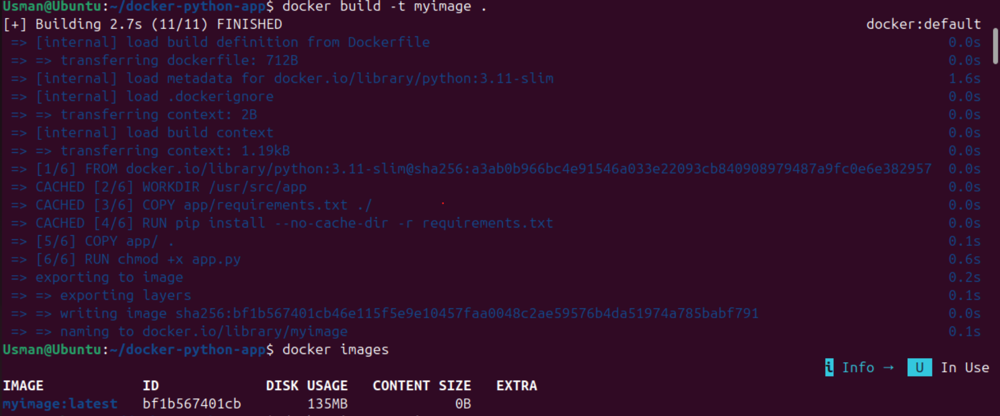
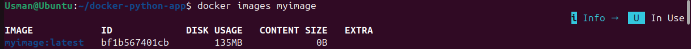
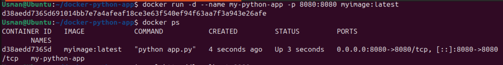
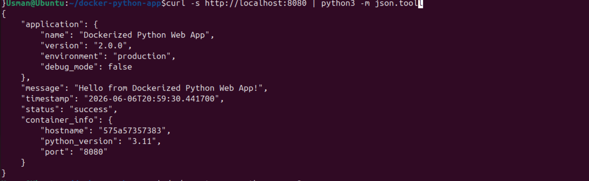
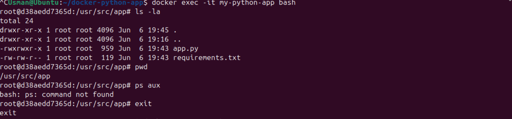
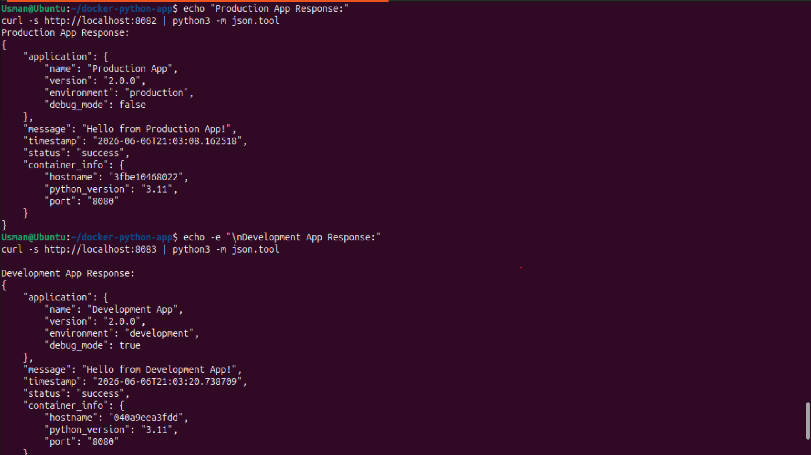
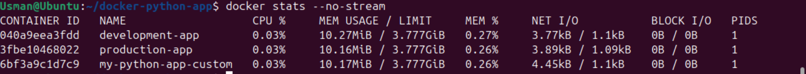

# Lab 6: Building and Customizing Containerized Python Applications with Dockerfile


---

## 🎯 Lab Objectives

By completing this hands-on engineering lab, I mastered the following core milestones:
*   **Dockerfile Architecture:** Decoded the structure, syntax, and lifecycle mechanics of writing production-ready Dockerfiles.
*   **Custom Image Engineering:** Engineered slim, multi-layered custom Docker images for Python applications using targeted build contexts.
*   **Configuration Decoupling:** Implemented robust configuration patterns using runtime environment variable overrides (`ENV` and `-e`).
*   **Security & Health Auditing:** Enforced security best practices by implementing non-root isolation layers and proactive container `HEALTHCHECK` states.
*   **Environment Management:** Automated deployments with explicit configuration tracking using Docker Compose declarations.

---

## 💻 Commands Practiced

```bash
# ==========================================
# PHASE 1: DIRECTORY STRUCTURE & COMPONENT SETUP
# ==========================================

# Create a clean root project workspace for the application context
mkdir ~/docker-python-app

# Move context into the new project workspace
cd ~/docker-python-app

# Create a dedicated subdirectory for application source files
mkdir app

# Verify creation and review current directory access permissions
ls -la

# Navigate inside the application directory to initialize files
cd app

# Formulate the initial simple Python web application script
nano app.py

# Initialize standard Python package requirements tracking manifest
nano requirements.txt

# Return back up to the project root directory context
cd ~/docker-python-app

# Define the build-blueprint file for the custom Docker image
nano Dockerfile

# Audit overall workspace structure tree (Fallback to find if tree is absent)
tree ~/docker-python-app || find ~/docker-python-app -type f -exec ls -la {} \;


# ==========================================
# PHASE 2: IMAGE CONSTRUCTION & INSPECTION
# ==========================================

# Force execution workspace to root context before building
cd ~/docker-python-app

# Build the custom Docker image tagging it with the target repository name
docker build -t myimage .

# Query the local image registry to verify the new image exists
docker images

# Execute targeted image discovery for the specific repository tag
docker images myimage

# Parse low-level configuration JSON structural data for our built image
docker inspect myimage

# Trace immutable internal structural filesystem layer lineage
docker history myimage


# ==========================================
# PHASE 3: CONTAINER RUNTIME & ENGINE DEPLOYMENT
# ==========================================

# Launch a detached background container mapping local traffic into the target environment
docker run -d -p 8080:8080 --name my-python-app myimage

# Audit active execution engine runtimes to ensure container state is healthy
docker ps

# Issue validation HTTP requests against the application web port 
curl http://localhost:8080

# Alternative system network tool check to extract raw web page headers
wget -qO- http://localhost:8080

# Stream standard outputs and standard errors to check internal engine state
docker logs my-python-app

# Attach an interactive terminal pseudo-TTY to execute queries inside the container
docker exec -it my-python-app bash


# ==========================================
# PHASE 4: ARCHITECTURE ITERATION & MULTI-ENV OVERRIDES
# ==========================================

# Signal container processes to stop execution immediately
docker stop my-python-app

# Purge structural container allocations to clear resource configurations
docker rm my-python-app

# Audit absolute container listings to confirm full removal
docker ps -a

# Access application files to enhance the baseline application
cd ~/docker-python-app/app

# Duplicate baseline application script code state to generate a safe backup
cp app.py app.py.backup

# Open code workspace editor to enrich the application infrastructure
nano app.py

# Access root project workspace directory to edit configuration files
cd ~/docker-python-app

# Back up baseline stable Dockerfile build blueprint configuration
cp Dockerfile Dockerfile.backup

# Open blueprint workspace editor to apply optimizations and hardening steps
nano Dockerfile

# Build explicit infrastructure configs by creating a Docker Compose environment map
nano docker-compose.yml

# Re-build modern production tier configuration using image version-tags
docker build -t myimage:v2 .

# Map modern version release tag over standard system latest tier configuration
docker build -t myimage:latest .

# Run validation checks across local registries to match specific image versions
docker images myimage

# Formulate quick scannable views displaying repository tracking tags and storage sizes
docker images --format "table {{.Repository}}\t{{.Tag}}\t{{.Size}}\t{{.CreatedAt}}"

# Deploy detached versioned container via default configuration blueprints
docker run -d -p 8080:8080 --name my-python-app-v2 myimage:v2

# Audit operational containers to track ports and run states
docker ps

# Issue quick verification requests to trace response fields
curl http://localhost:8080

# Pipe payload arrays directly to interactive formatting engines for inspection
curl -s http://localhost:8080 | python3 -m json.tool

# Stop the run trace of the baseline container to verify manual environmental overrides
docker stop my-python-app-v2

# Deploy customized container injecting overrides dynamically during runtime
docker run -d -p 8081:8080 \
  --name my-python-app-custom \
  -e APP_NAME="Custom Docker App" \
  -e APP_VERSION="3.0.0" \
  -e ENVIRONMENT="development" \
  -e DEBUG="true" \
  myimage:v2

# Validate structural responses from customized runtime overrides
curl http://localhost:8081

# Deploy dedicated staging/production isolation tier running standard strict configs
docker run -d -p 8082:8080 \
  --name production-app \
  -e APP_NAME="Production App" \
  -e ENVIRONMENT="production" \
  -e DEBUG="false" \
  myimage:v2

# Deploy parallel developer isolation tier injecting high visibility configurations
docker run -d -p 8083:8080 \
  --name development-app \
  -e APP_NAME="Development App" \
  -e ENVIRONMENT="development" \
  -e DEBUG="true" \
  myimage:v2

# Query production environment configurations to verify production status
echo "Production App Response:"
curl -s http://localhost:8082 | python3 -m json.tool

# Query sandbox developer environment responses to verify debugging logs
echo -e "\nDevelopment App Response:"
curl -s http://localhost:8083 | python3 -m json.tool

# Review running container infrastructure layouts cleanly formatted as a table
docker ps --format "table {{.Names}}\t{{.Image}}\t{{.Ports}}\t{{.Status}}"

# Sample system computational consumption configurations for all active containers
docker stats --no-stream


# ==========================================
# PHASE 5: SYSTEM CLEANUP & LABORATORY RESET
# ==========================================

# Signal all active engine runtime resources to pause and close
docker stop $(docker ps -q)

# Evict all structural allocations from system memory spaces
docker rm $(docker ps -aq)

# Purge specific images to preserve local disk capacity spaces
docker rmi myimage:latest myimage:v2

# Enforce clean system passes removing untagged networks, caches, and images
docker system prune -f
```

---

## 📝 My Learning Notes

### Dockerfile Structural Best Practices
*   **Layer Optimization:** Placed `COPY app/requirements.txt ./` before migrating general source repositories (`COPY app/ .`). This enforces intelligent layer caching, skipping expensive dependency tracking steps (`pip install`) unless dependency files change.
*   **Minimal Base Images:** Employed `python:3.11-slim` instead of standard fat images. This drops image sizes to ~125MB, decreasing attack surfaces and deployment network transfer latency.
*   **Security Isolation via Least Privilege:** Swapped standard administrative root bindings out by declaring explicit security permissions:

```dockerfile
    RUN groupadd -r appuser && useradd -r -g appuser appuser
    USER appuser
    ```

    *Takeaway:* Dropping runtime access privileges stops potential container breakout vulnerabilities from gaining administrative command vectors on the underlying host Linux kernel.
*   **Engine Failure Recovery Audits:** Integrated structural tracking parameters directly into image metadata configurations via proactive monitoring:
```dockerfile
    HEALTHCHECK --interval=30s --timeout=3s --start-period=5s --retries=3 \
      CMD curl -f http://localhost:$PORT/ || exit 1
    ```

### Decoupling Logic from Runtime Environments
*   **Configuration Variables (`ENV` vs. Runtime `-e`):** Explicitly managed state properties through decoupled configurations. Implemented standard variable tracking maps using fallback options inside application architectures (`os.environ.get()`), and mapped these states cleanly via native Docker Compose variable maps.

---

## 📸 Step-by-Step Verification Screenshots

### Phase 1: Context Verification & Image Assembly
*   **Workspace Validation Listing:** Verifying project workspace tracking files structure prior to execution.

*   **Container Blueprint Compilation:** Monitoring granular build steps, layer assembly, and caching engine outputs during execution.

*   **Local Registries Discovery Inventory:** Confirming the custom image registry records repository details, tags, and sizes cleanly.


### Phase 2: Running Containers & Live Audits
*   **Production Tier Engine Activations:** Confirming runtime engine state loops, detached network exposures, and internal tracking names.

*   **Data Verification Request Profiles:** Verifying live web socket feedback, internal tracking arrays, and metadata signatures.

*   **Internal Component System Shell Checks:** Tracking isolated storage trees, processing tables, and directory variables inside the container environment.


### Phase 3: Multiple Environments & Environment Variable Overrides
*   **Parallel Isolation Tier Architecture:** Verifying parallel test operations across unique isolation configurations (Production vs Development tiers).

*   **Active Microservices Resource Monitoring Profiles:** Sampling standard system computational statistics, tracking processing streams, and tracing system memory.


---

## 🛠️ Troubleshooting & Engineering Insights

### Issue 1: Image Assembly Failure Due to Local Account Permission Errors
*   **The Root Issue:** The execution user profile lacks explicit group membership links inside the system `docker` engineering daemon socket mappings (`/var/run/docker.sock`), causing file validation failures.
*   **My Fix:** Permanently map user security accounts over to target platform management teams and immediately reload session environmental permissions:
```bash
    sudo usermod -aG docker $USER
    newgrp docker
    ```

### Issue 2: Socket Deployment Collisions (Port Already in Use)
*   **The Root Issue:** The target host interface port socket mapping (`8080`) is already locked down by a conflicting service block or stale legacy container allocation.
*   **My Fix:** Query system network mapping files to isolate conflicting application processes, extract unique process target tags, and purge competing container environments programmatically:
```bash
    sudo netstat -tulpn | grep :8080
    docker stop $(docker ps -q --filter "publish=8080")
    ```

### Issue 3: Volatile Lifecycle Faults (Containers Exiting Immediately)
*   **The Root Issue:** The internal entrypoint processes or configuration scripts crashed right after launch due to unhandled exceptions, missing dependency packages, or syntax execution bugs.
*   **My Fix:** Audit internal terminal message queues to locate runtime exceptions, or bypass the standard entrypoint configuration to run live diagnostic steps directly in a secure sandbox:
```bash
    docker logs my-python-app-v2
    docker run -it --rm myimage:v2 bash
    ```

---

## 🏁 Conclusion

This comprehensive laboratory project establishes a critical milestone in mastering immutable infrastructure by transforming raw source scripts into hardened, minimal, and highly configurable containerized microservices. Elevating standard operational configurations through declarative multi-tier variables and automated container health checks provides a core architectural foundation for building scalable AIOps pipelines and cloud-native orchestration frameworks.
